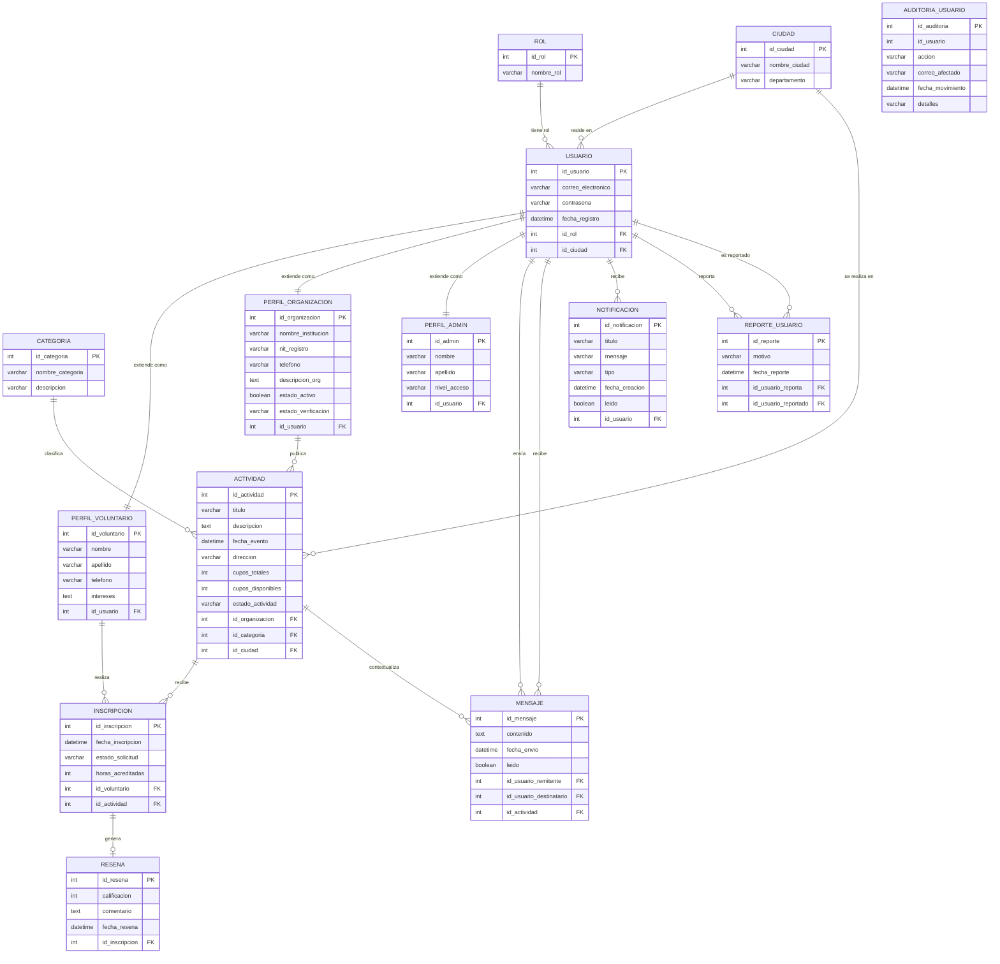
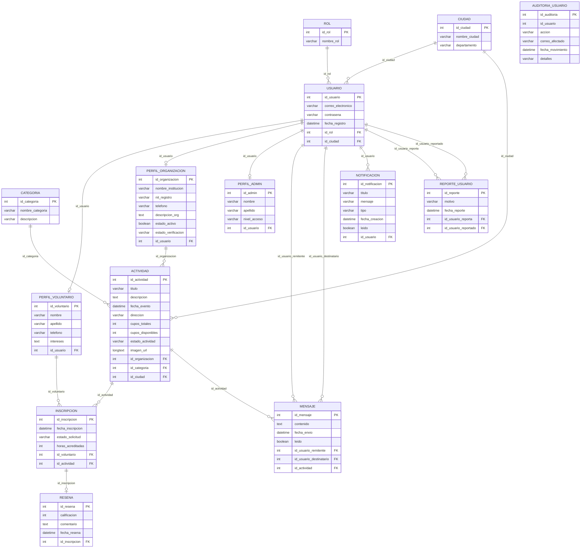

# Proyecto Bases de Datos II - Plataforma "Voluntariado"

Este repositorio contiene el diseño, estructuración e implementación del sistema de base de datos relacional para la plataforma de gestión social y comunitaria **Voluntariado**. Este proyecto toma como base un diseño inicial y lo extiende aplicando conceptos avanzados de Bases de Datos II, tales como triggers (desencadenadores), tablas transaccionales de auditoría y mecanismos de moderación.

---

## Entrega 1 — Diseño y Arquitectura de la Base de Datos

### 1. Enunciado del Problema a Sistematizar

#### Contexto y Necesidades Detectadas
En la actualidad, las organizaciones sin fines de lucro y los ciudadanos interesados en realizar labores sociales carecen de un canal centralizado, seguro y eficiente para coordinar actividades de voluntariado. Las organizaciones enfrentan serios inconvenientes técnicos para publicar sus campañas de forma geolocalizada, controlar dinámicamente el aforo (cupos disponibles) y realizar la trazabilidad o validación de la asistencia real de los participantes. Por otro lado, los voluntarios carecen de un historial consolidado y transparente de sus horas acreditadas, así como de un canal directo, ordenado y seguro para comunicarse con las instituciones organizadoras.

Adicionalmente, desde la perspectiva de la seguridad informática y la gestión de la comunidad (módulos críticos de **Usuarios y Comunicaciones**), se identificó la necesidad de auditar de forma automática todos los accesos y modificaciones en las credenciales críticas de las cuentas de usuario para mitigar riesgos de suplantación. Del mismo modo, debido a la interacción directa entre usuarios dentro del chat, se requiere un mecanismo técnico en el motor de la base de datos para reportar comportamientos fraudulentos (como spam o acoso), garantizando así la moderación de la comunidad y la integridad del ecosistema informático.

#### Alcance del Sistema
El sistema automatiza el control de acceso segmentado por roles (Administradores, Voluntarios, Organizaciones), el aprovisionamiento de perfiles especializados (relaciones 1:1), la publicación geográfica de actividades por categorías, la gestión transaccional de inscripciones con actualización en cascada de cupos disponibles, un sistema cerrado de mensajería interna parametrizado por actividad, y módulos avanzados de seguridad (auditoría automática) y moderación (reporte de incidencias).

---

### 2.1 Nombre de la Base de Datos
**Nombre:** `voluntariado`

---

### 2.2 Listado y Clasificación de Tablas (14 Tablas en Total)

Para cumplir con los estándares de la materia, la base de datos ha sido estructurada separando las tablas maestras/catálogos (**Referenciales**) de los flujos de información operativa y transaccional (**De Movimiento**).

#### Tablas Referenciales (Catálogos y Perfiles de Extensión)
| # | Tabla | Descripción |
|---|-------|-------------|
| 1 | `ROL` | Define los niveles de acceso del sistema (`Administrador`, `Voluntario`, `Organizacion`). |
| 2 | `CIUDAD` | Registro geográfico estático (Municipio y Departamento) para zonificación. |
| 3 | `CATEGORIA` | Clasificación del enfoque social de las actividades (`Medio Ambiente`, `Educación`, `Salud`). |
| 4 | `PERFIL_VOLUNTARIO` | Datos demográficos y áreas de interés específicas del ciudadano voluntario. |
| 5 | `PERFIL_ORGANIZACION` | Datos institucionales, NIT y estado de verificación legal de las fundaciones. |
| 6 | `PERFIL_ADMIN` | Registro e identificación del personal interno administrativo de la plataforma. |

#### Tablas de Movimiento (Transacciones, Logs y Comunicaciones)
| # | Tabla | Descripción |
|---|-------|-------------|
| 7 | `USUARIO` | Entidad central de autenticación (llave de entrada con relaciones 1:1 hacia perfiles). |
| 8 | `ACTIVIDAD` | Eventos o campañas sociales publicadas con control de estados y fechas. |
| 9 | `INSCRIPCION` | Registro transaccional de la postulación de un voluntario a una actividad con acreditación de horas. |
| 10 | `RESENA` | Calificaciones numéricas y comentarios de retroalimentación post-evento. |
| 11 | `MENSAJE` | Chat bidireccional asincrónico entre usuarios con metadatos de lectura y referencia de actividad. |
| 12 | `NOTIFICACION` | Repositorio de alertas del sistema enviadas a los usuarios por eventos clave. |
| 13 | `AUDITORIA_USUARIO` | **(Nueva - Bases II)** Registro automatizado (Log) de operaciones críticas de seguridad. |
| 14 | `REPORTE_USUARIO` | **(Nueva - Bases II)** Registro transaccional de denuncias entre usuarios por moderación. |

---

### 2.3 Diccionario de Datos

#### Tabla: ROL
| Campo | Nombre del Campo | Tipo | Tamaño | Descripción |
|-------|-----------------|------|--------|-------------|
| PK | `id_rol` | INT | — | Identificador único del rol. Auto-incremental. |
| — | `nombre_rol` | VARCHAR | 50 | Nombre descriptivo del rol (`Administrador`, `Voluntario`, `Organizacion`). Valor único. |

#### Tabla: CIUDAD
| Campo | Nombre del Campo | Tipo | Tamaño | Descripción |
|-------|-----------------|------|--------|-------------|
| PK | `id_ciudad` | INT | — | Identificador único del municipio. Auto-incremental. |
| — | `nombre_ciudad` | VARCHAR | 100 | Nombre del municipio (ej. `Medellín`, `Bogotá`). |
| — | `departamento` | VARCHAR | 100 | Departamento al que pertenece el municipio (ej. `Antioquia`). Opcional. |

#### Tabla: CATEGORIA
| Campo | Nombre del Campo | Tipo | Tamaño | Descripción |
|-------|-----------------|------|--------|-------------|
| PK | `id_categoria` | INT | — | Identificador único de la categoría. Auto-incremental. |
| — | `nombre_categoria` | VARCHAR | 50 | Nombre del enfoque social (ej. `Educación`, `Salud y Bienestar`). Valor único. |
| — | `descripcion` | VARCHAR | 255 | Texto explicativo sobre el tipo de actividades que agrupa la categoría. Opcional. |

#### Tabla: USUARIO
| Campo | Nombre del Campo | Tipo | Tamaño | Descripción |
|-------|-----------------|------|--------|-------------|
| PK | `id_usuario` | INT | — | Identificador único de la cuenta. Auto-incremental. |
| — | `correo_electronico` | VARCHAR | 100 | Correo de inicio de sesión. Valor único y obligatorio. |
| — | `contrasena` | VARCHAR | 255 | Clave de acceso encriptada. Obligatoria. |
| — | `fecha_registro` | DATETIME | — | Fecha y hora de creación de la cuenta. Valor por defecto: fecha actual. |
| FK | `id_rol` | INT | — | Referencia a `ROL`. Determina los permisos del usuario. |
| FK | `id_ciudad` | INT | — | Referencia a `CIUDAD`. Ciudad base del usuario. Opcional. |

#### Tabla: PERFIL_VOLUNTARIO
| Campo | Nombre del Campo | Tipo | Tamaño | Descripción |
|-------|-----------------|------|--------|-------------|
| PK | `id_voluntario` | INT | — | Identificador único del perfil voluntario. Auto-incremental. |
| — | `nombre` | VARCHAR | 100 | Nombre(s) del voluntario. Obligatorio. |
| — | `apellido` | VARCHAR | 100 | Apellido(s) del voluntario. Obligatorio. |
| — | `telefono` | VARCHAR | 20 | Número de contacto celular o fijo. Opcional. |
| — | `intereses` | TEXT | — | Descripción libre de áreas de interés social del voluntario. Opcional. |
| FK | `id_usuario` | INT | — | Referencia única a `USUARIO`. Relación 1:1. Eliminación en cascada. |

#### Tabla: PERFIL_ORGANIZACION
| Campo | Nombre del Campo | Tipo | Tamaño | Descripción |
|-------|-----------------|------|--------|-------------|
| PK | `id_organizacion` | INT | — | Identificador único del perfil institucional. Auto-incremental. |
| — | `nombre_institucion` | VARCHAR | 150 | Razón social o nombre oficial de la organización. Obligatorio. |
| — | `nit_registro` | VARCHAR | 50 | NIT tributario de la entidad. Valor único y obligatorio. |
| — | `telefono` | VARCHAR | 20 | Número de contacto institucional. Opcional. |
| — | `descripcion_org` | TEXT | — | Misión y descripción general de la organización. Opcional. |
| — | `estado_activo` | BOOLEAN | — | Indica si la organización está habilitada para publicar. Valor por defecto: `TRUE`. |
| — | `estado_verificacion` | VARCHAR | 20 | Estado de validación legal (`PENDIENTE`, `VERIFICADA`, `RECHAZADA`). Por defecto: `PENDIENTE`. |
| FK | `id_usuario` | INT | — | Referencia única a `USUARIO`. Relación 1:1. Eliminación en cascada. |

#### Tabla: PERFIL_ADMIN
| Campo | Nombre del Campo | Tipo | Tamaño | Descripción |
|-------|-----------------|------|--------|-------------|
| PK | `id_admin` | INT | — | Identificador único del administrador. Auto-incremental. |
| — | `nombre` | VARCHAR | 100 | Nombre(s) del administrador de la plataforma. Obligatorio. |
| — | `apellido` | VARCHAR | 100 | Apellido(s) del administrador. Obligatorio. |
| — | `nivel_acceso` | VARCHAR | 50 | Categoría de permisos internos (`GENERAL`, `SUPER_ADMIN`). Por defecto: `GENERAL`. |
| FK | `id_usuario` | INT | — | Referencia única a `USUARIO`. Relación 1:1. Eliminación en cascada. |

#### Tabla: ACTIVIDAD
| Campo | Nombre del Campo | Tipo | Tamaño | Descripción |
|-------|-----------------|------|--------|-------------|
| PK | `id_actividad` | INT | — | Identificador único del evento. Auto-incremental. |
| — | `titulo` | VARCHAR | 150 | Nombre público de la campaña o evento. Obligatorio. |
| — | `descripcion` | TEXT | — | Detalle de la actividad, requisitos y objetivos. Opcional. |
| — | `fecha_evento` | DATETIME | — | Fecha y hora de realización del evento. Obligatorio. |
| — | `direccion` | VARCHAR | 200 | Dirección física o punto de encuentro del evento. Opcional. |
| — | `cupos_totales` | INT | — | Número máximo de voluntarios permitidos. Por defecto: `0`. |
| — | `cupos_disponibles` | INT | — | Cupos aún disponibles para inscripción. Por defecto: `0`. |
| — | `estado_actividad` | VARCHAR | 20 | Estado del evento (`PUBLICADA`, `CANCELADA`, `FINALIZADA`). Por defecto: `PUBLICADA`. |
| — | `imagen_url` | LONGTEXT | — | URL o base64 de la imagen de portada de la actividad. Opcional. |
| FK | `id_organizacion` | INT | — | Referencia a `PERFIL_ORGANIZACION`. Organización que publica el evento. |
| FK | `id_categoria` | INT | — | Referencia a `CATEGORIA`. Enfoque social del evento. |
| FK | `id_ciudad` | INT | — | Referencia a `CIUDAD`. Municipio donde se realiza el evento. |

#### Tabla: INSCRIPCION
| Campo | Nombre del Campo | Tipo | Tamaño | Descripción |
|-------|-----------------|------|--------|-------------|
| PK | `id_inscripcion` | INT | — | Identificador único de la postulación. Auto-incremental. |
| — | `fecha_inscripcion` | DATETIME | — | Fecha y hora en que el voluntario se postuló. Por defecto: fecha actual. |
| — | `estado_solicitud` | VARCHAR | 20 | Estado del proceso (`PENDIENTE`, `APROBADA`, `RECHAZADA`). Por defecto: `PENDIENTE`. |
| — | `horas_acreditadas` | INT | — | Horas de voluntariado certificadas al completar la actividad. Por defecto: `0`. |
| FK | `id_voluntario` | INT | — | Referencia a `PERFIL_VOLUNTARIO`. Voluntario que se inscribe. |
| FK | `id_actividad` | INT | — | Referencia a `ACTIVIDAD`. Evento al que se postula. Combinación única con `id_voluntario`. |

#### Tabla: RESENA
| Campo | Nombre del Campo | Tipo | Tamaño | Descripción |
|-------|-----------------|------|--------|-------------|
| PK | `id_resena` | INT | — | Identificador único de la reseña. Auto-incremental. |
| — | `calificacion` | INT | — | Puntuación numérica del evento. Valor entre `1` y `5`. Obligatorio. |
| — | `comentario` | TEXT | — | Retroalimentación escrita del voluntario sobre la actividad. Opcional. |
| — | `fecha_resena` | DATETIME | — | Fecha y hora de publicación de la reseña. Por defecto: fecha actual. |
| FK | `id_inscripcion` | INT | — | Referencia a `INSCRIPCION`. Solo un voluntario inscrito puede reseñar. Eliminación en cascada. |

#### Tabla: MENSAJE
| Campo | Nombre del Campo | Tipo | Tamaño | Descripción |
|-------|-----------------|------|--------|-------------|
| PK | `id_mensaje` | INT | — | Identificador único del mensaje. Auto-incremental. |
| — | `contenido` | TEXT | — | Texto del mensaje enviado. Obligatorio. |
| — | `fecha_envio` | DATETIME | — | Fecha y hora de envío. Por defecto: fecha actual. |
| — | `leido` | BOOLEAN | — | Indica si el destinatario leyó el mensaje. Por defecto: `FALSE`. |
| FK | `id_usuario_remitente` | INT | — | Referencia a `USUARIO`. Usuario que envía el mensaje. |
| FK | `id_usuario_destinatario` | INT | — | Referencia a `USUARIO`. Usuario que recibe el mensaje. |
| FK | `id_actividad` | INT | — | Referencia a `ACTIVIDAD`. Contexto de la conversación. Opcional (`NULL` si es chat libre). |

#### Tabla: NOTIFICACION
| Campo | Nombre del Campo | Tipo | Tamaño | Descripción |
|-------|-----------------|------|--------|-------------|
| PK | `id_notificacion` | INT | — | Identificador único de la notificación. Auto-incremental. |
| — | `titulo` | VARCHAR | 150 | Encabezado corto de la alerta. Obligatorio. |
| — | `mensaje` | VARCHAR | 500 | Cuerpo descriptivo de la notificación. Obligatorio. |
| — | `tipo` | VARCHAR | 40 | Categoría de la alerta (`GENERAL`, `INSCRIPCION`, `SISTEMA`). Por defecto: `GENERAL`. |
| — | `fecha_creacion` | DATETIME | — | Fecha y hora de generación de la alerta. Por defecto: fecha actual. |
| — | `leido` | BOOLEAN | — | Indica si el usuario ya consultó la notificación. Por defecto: `FALSE`. |
| FK | `id_usuario` | INT | — | Referencia a `USUARIO`. Destinatario de la alerta. Eliminación en cascada. |

#### Tabla: AUDITORIA_USUARIO
| Campo | Nombre del Campo | Tipo | Tamaño | Descripción |
|-------|-----------------|------|--------|-------------|
| PK | `id_auditoria` | INT | — | Identificador único del evento auditado. Auto-incremental. |
| — | `id_usuario` | INT | — | ID de la cuenta que generó el evento de seguridad. |
| — | `accion` | VARCHAR | 20 | Tipo de operación interceptada (`REGISTRO`, `CAMBIO_CONTRASENA`). Obligatorio. |
| — | `correo_afectado` | VARCHAR | 100 | Respaldo del correo del usuario al momento de la transacción. Opcional. |
| — | `fecha_movimiento` | DATETIME | — | Estampa de tiempo exacta del disparo del trigger. Por defecto: fecha actual. |
| — | `detalles` | VARCHAR | 255 | Descripción del evento técnico registrado. Opcional. |

#### Tabla: REPORTE_USUARIO
| Campo | Nombre del Campo | Tipo | Tamaño | Descripción |
|-------|-----------------|------|--------|-------------|
| PK | `id_reporte` | INT | — | Código único del reporte de moderación. Auto-incremental. |
| — | `motivo` | VARCHAR | 255 | Razón o argumento de la denuncia (ej. Spam, acoso, enlace malicioso). Obligatorio. |
| — | `fecha_reporte` | DATETIME | — | Fecha y hora del radicado de la queja. Por defecto: fecha actual. |
| FK | `id_usuario_reporta` | INT | — | Referencia a `USUARIO`. Identificador del usuario que emite la queja. |
| FK | `id_usuario_reportado` | INT | — | Referencia a `USUARIO`. Identificador del presunto infractor. |

---

### 2.4 Modelo Entidad-Relación

El siguiente diagrama representa el modelo conceptual del sistema, mostrando las entidades principales y sus relaciones semánticas.



---

### 2.5 Diagrama Relacional

El siguiente diagrama muestra el modelo físico de la base de datos con las tablas, sus atributos, llaves primarias (PK) y llaves foráneas (FK) con sus referencias explícitas.



---

## Entrega 2 — Implementación en MySQL

### 3. Creación de la Base de Datos y Tablas en MySQL

A continuación se presenta el script SQL completo utilizado para crear la base de datos `voluntariado` en el motor **MariaDB 10.4 (XAMPP)**. El script incluye la creación de todas las tablas, las restricciones de integridad referencial, los triggers de auditoría y los datos de prueba iniciales.

#### 3.1 Creación de la Base de Datos

```sql
CREATE DATABASE IF NOT EXISTS voluntariado
  CHARACTER SET utf8mb4
  COLLATE utf8mb4_unicode_ci;

USE voluntariado;
```

#### 3.2 Tablas Referenciales

```sql
-- Tabla de roles del sistema
CREATE TABLE IF NOT EXISTS ROL (
  id_rol      INT PRIMARY KEY AUTO_INCREMENT,
  nombre_rol  VARCHAR(50) NOT NULL UNIQUE
) ENGINE=InnoDB;

-- Tabla de ciudades/municipios
CREATE TABLE IF NOT EXISTS CIUDAD (
  id_ciudad     INT PRIMARY KEY AUTO_INCREMENT,
  nombre_ciudad VARCHAR(100) NOT NULL,
  departamento  VARCHAR(100)
) ENGINE=InnoDB;

-- Tabla de categorías de actividades
CREATE TABLE IF NOT EXISTS CATEGORIA (
  id_categoria     INT PRIMARY KEY AUTO_INCREMENT,
  nombre_categoria VARCHAR(50) NOT NULL UNIQUE,
  descripcion      VARCHAR(255)
) ENGINE=InnoDB;
```

#### 3.3 Tabla Central y Perfiles (Relaciones 1:1)

```sql
-- Tabla central de autenticación
CREATE TABLE IF NOT EXISTS USUARIO (
  id_usuario          INT PRIMARY KEY AUTO_INCREMENT,
  correo_electronico  VARCHAR(100) NOT NULL UNIQUE,
  contrasena          VARCHAR(255) NOT NULL,
  fecha_registro      DATETIME NOT NULL DEFAULT CURRENT_TIMESTAMP,
  id_rol              INT NOT NULL,
  id_ciudad           INT,
  CONSTRAINT fk_usuario_rol    FOREIGN KEY (id_rol)    REFERENCES ROL(id_rol),
  CONSTRAINT fk_usuario_ciudad FOREIGN KEY (id_ciudad) REFERENCES CIUDAD(id_ciudad)
) ENGINE=InnoDB;

-- Perfil extendido del voluntario (1:1 con USUARIO)
CREATE TABLE IF NOT EXISTS PERFIL_VOLUNTARIO (
  id_voluntario INT PRIMARY KEY AUTO_INCREMENT,
  nombre        VARCHAR(100) NOT NULL,
  apellido      VARCHAR(100) NOT NULL,
  telefono      VARCHAR(20),
  intereses     TEXT,
  id_usuario    INT NOT NULL UNIQUE,
  CONSTRAINT fk_pv_usuario FOREIGN KEY (id_usuario) REFERENCES USUARIO(id_usuario) ON DELETE CASCADE
) ENGINE=InnoDB;

-- Perfil extendido de la organización (1:1 con USUARIO)
CREATE TABLE IF NOT EXISTS PERFIL_ORGANIZACION (
  id_organizacion    INT PRIMARY KEY AUTO_INCREMENT,
  nombre_institucion VARCHAR(150) NOT NULL,
  nit_registro       VARCHAR(50) NOT NULL UNIQUE,
  telefono           VARCHAR(20),
  descripcion_org    TEXT,
  estado_activo      BOOLEAN NOT NULL DEFAULT TRUE,
  estado_verificacion VARCHAR(20) NOT NULL DEFAULT 'PENDIENTE',
  id_usuario         INT NOT NULL UNIQUE,
  CONSTRAINT fk_po_usuario FOREIGN KEY (id_usuario) REFERENCES USUARIO(id_usuario) ON DELETE CASCADE
) ENGINE=InnoDB;

-- Perfil extendido del administrador (1:1 con USUARIO)
CREATE TABLE IF NOT EXISTS PERFIL_ADMIN (
  id_admin      INT PRIMARY KEY AUTO_INCREMENT,
  nombre        VARCHAR(100) NOT NULL,
  apellido      VARCHAR(100) NOT NULL,
  nivel_acceso  VARCHAR(50) NOT NULL DEFAULT 'GENERAL',
  id_usuario    INT NOT NULL UNIQUE,
  CONSTRAINT fk_pa_usuario FOREIGN KEY (id_usuario) REFERENCES USUARIO(id_usuario) ON DELETE CASCADE
) ENGINE=InnoDB;
```

#### 3.4 Tablas de Movimiento

```sql
-- Actividades publicadas por las organizaciones
CREATE TABLE IF NOT EXISTS ACTIVIDAD (
  id_actividad      INT PRIMARY KEY AUTO_INCREMENT,
  titulo            VARCHAR(150) NOT NULL,
  descripcion       TEXT,
  fecha_evento      DATETIME NOT NULL,
  direccion         VARCHAR(200),
  cupos_totales     INT NOT NULL DEFAULT 0,
  cupos_disponibles INT NOT NULL DEFAULT 0,
  estado_actividad  VARCHAR(20) NOT NULL DEFAULT 'PUBLICADA',
  imagen_url        LONGTEXT,
  id_organizacion   INT NOT NULL,
  id_categoria      INT NOT NULL,
  id_ciudad         INT NOT NULL,
  CONSTRAINT fk_act_org    FOREIGN KEY (id_organizacion) REFERENCES PERFIL_ORGANIZACION(id_organizacion) ON DELETE CASCADE,
  CONSTRAINT fk_act_cat    FOREIGN KEY (id_categoria)    REFERENCES CATEGORIA(id_categoria),
  CONSTRAINT fk_act_ciudad FOREIGN KEY (id_ciudad)       REFERENCES CIUDAD(id_ciudad)
) ENGINE=InnoDB;

-- Inscripciones de voluntarios a actividades
CREATE TABLE IF NOT EXISTS INSCRIPCION (
  id_inscripcion     INT PRIMARY KEY AUTO_INCREMENT,
  fecha_inscripcion  DATETIME NOT NULL DEFAULT CURRENT_TIMESTAMP,
  estado_solicitud   VARCHAR(20) NOT NULL DEFAULT 'PENDIENTE',
  horas_acreditadas  INT NOT NULL DEFAULT 0,
  id_voluntario      INT NOT NULL,
  id_actividad       INT NOT NULL,
  CONSTRAINT fk_ins_vol UNIQUE (id_voluntario, id_actividad),
  CONSTRAINT fk_ins_voluntario FOREIGN KEY (id_voluntario) REFERENCES PERFIL_VOLUNTARIO(id_voluntario) ON DELETE CASCADE,
  CONSTRAINT fk_ins_actividad  FOREIGN KEY (id_actividad)  REFERENCES ACTIVIDAD(id_actividad) ON DELETE CASCADE
) ENGINE=InnoDB;

-- Reseñas post-evento de los voluntarios
CREATE TABLE IF NOT EXISTS RESENA (
  id_resena      INT PRIMARY KEY AUTO_INCREMENT,
  calificacion   INT NOT NULL,
  comentario     TEXT,
  fecha_resena   DATETIME NOT NULL DEFAULT CURRENT_TIMESTAMP,
  id_inscripcion INT NOT NULL,
  CONSTRAINT fk_res_ins   FOREIGN KEY (id_inscripcion) REFERENCES INSCRIPCION(id_inscripcion) ON DELETE CASCADE,
  CONSTRAINT chk_res_calif CHECK (calificacion BETWEEN 1 AND 5)
) ENGINE=InnoDB;

-- Sistema de mensajería interna
CREATE TABLE IF NOT EXISTS MENSAJE (
  id_mensaje              INT PRIMARY KEY AUTO_INCREMENT,
  contenido               TEXT NOT NULL,
  fecha_envio             DATETIME NOT NULL DEFAULT CURRENT_TIMESTAMP,
  leido                   BOOLEAN NOT NULL DEFAULT FALSE,
  id_usuario_remitente    INT NOT NULL,
  id_usuario_destinatario INT NOT NULL,
  id_actividad            INT NULL,
  CONSTRAINT fk_msg_remitente    FOREIGN KEY (id_usuario_remitente)    REFERENCES USUARIO(id_usuario) ON DELETE CASCADE,
  CONSTRAINT fk_msg_destinatario FOREIGN KEY (id_usuario_destinatario) REFERENCES USUARIO(id_usuario) ON DELETE CASCADE,
  CONSTRAINT fk_msg_actividad    FOREIGN KEY (id_actividad)            REFERENCES ACTIVIDAD(id_actividad) ON DELETE SET NULL
) ENGINE=InnoDB;

-- Notificaciones del sistema a los usuarios
CREATE TABLE IF NOT EXISTS NOTIFICACION (
  id_notificacion INT PRIMARY KEY AUTO_INCREMENT,
  titulo          VARCHAR(150) NOT NULL,
  mensaje         VARCHAR(500) NOT NULL,
  tipo            VARCHAR(40)  NOT NULL DEFAULT 'GENERAL',
  fecha_creacion  DATETIME NOT NULL DEFAULT CURRENT_TIMESTAMP,
  leido           BOOLEAN NOT NULL DEFAULT FALSE,
  id_usuario      INT NOT NULL,
  CONSTRAINT fk_noti_usuario FOREIGN KEY (id_usuario) REFERENCES USUARIO(id_usuario) ON DELETE CASCADE
) ENGINE=InnoDB;
```

#### 3.5 Tablas de Seguridad y Moderación (Bases de Datos II)

```sql
-- Log automático de eventos de seguridad (alimentado por triggers)
CREATE TABLE IF NOT EXISTS AUDITORIA_USUARIO (
  id_auditoria      INT PRIMARY KEY AUTO_INCREMENT,
  id_usuario        INT NOT NULL,
  accion            VARCHAR(20) NOT NULL,
  correo_afectado   VARCHAR(100),
  fecha_movimiento  DATETIME NOT NULL DEFAULT CURRENT_TIMESTAMP,
  detalles          VARCHAR(255)
) ENGINE=InnoDB;

-- Registro de denuncias entre usuarios
CREATE TABLE IF NOT EXISTS REPORTE_USUARIO (
  id_reporte           INT PRIMARY KEY AUTO_INCREMENT,
  motivo               VARCHAR(255) NOT NULL,
  fecha_reporte        DATETIME NOT NULL DEFAULT CURRENT_TIMESTAMP,
  id_usuario_reporta   INT NOT NULL,
  id_usuario_reportado INT NOT NULL,
  CONSTRAINT fk_rep_reporta   FOREIGN KEY (id_usuario_reporta)   REFERENCES USUARIO(id_usuario) ON DELETE CASCADE,
  CONSTRAINT fk_rep_reportado FOREIGN KEY (id_usuario_reportado) REFERENCES USUARIO(id_usuario) ON DELETE CASCADE
) ENGINE=InnoDB;
```

#### 3.6 Triggers de Auditoría Automática

```sql
DELIMITER //

-- Trigger 1: Registra automáticamente cada nuevo usuario creado
CREATE TRIGGER tg_auditoria_nuevo_usuario
AFTER INSERT ON USUARIO
FOR EACH ROW
BEGIN
  INSERT INTO AUDITORIA_USUARIO (id_usuario, accion, correo_afectado, detalles)
  VALUES (NEW.id_usuario, 'REGISTRO', NEW.correo_electronico, 'Se ha creado una nueva cuenta en el sistema.');
END //

-- Trigger 2: Detecta y registra cambios en la contraseña del usuario
CREATE TRIGGER tg_auditoria_cambio_clave
BEFORE UPDATE ON USUARIO
FOR EACH ROW
BEGIN
  IF OLD.contrasena <> NEW.contrasena THEN
    INSERT INTO AUDITORIA_USUARIO (id_usuario, accion, correo_afectado, detalles)
    VALUES (NEW.id_usuario, 'CAMBIO_CONTRASENA', NEW.correo_electronico, 'El usuario actualizó sus credenciales de acceso.');
  END IF;
END //

DELIMITER ;
```

#### 3.7 Datos de Prueba (INSERT iniciales)

```sql
-- Catálogos base
INSERT INTO ROL (nombre_rol) VALUES ('Administrador'), ('Voluntario'), ('Organizacion');

INSERT INTO CIUDAD (nombre_ciudad, departamento) VALUES
  ('Medellín', 'Antioquia'), ('Envigado', 'Antioquia'),
  ('Itagüí', 'Antioquia'), ('Bogotá', 'Cundinamarca');

INSERT INTO CATEGORIA (nombre_categoria, descripcion) VALUES
  ('Medio Ambiente', 'Reforestación, limpieza de ríos y cuidado animal.'),
  ('Educación', 'Tutorías a niños, alfabetización y talleres.'),
  ('Salud y Bienestar', 'Brigadas médicas, apoyo psicológico y donaciones.');

-- Usuarios de prueba (los INSERT en USUARIO disparan automáticamente tg_auditoria_nuevo_usuario)
INSERT INTO USUARIO (correo_electronico, contrasena, id_rol, id_ciudad) VALUES
  ('admin.central@voluntariado.org', 'admin1234', 1, 1),
  ('tomas.voluntario@gmail.com', 'claveVoluntario1', 2, 1),
  ('albert.voluntario@gmail.com', 'claveVoluntario2', 2, 2),
  ('contacto@fundacionverde.org', 'orgPass2026', 3, 1),
  ('usuario.problematico@gmail.com', 'spamPass99', 2, 3);

-- Perfiles extendidos
INSERT INTO PERFIL_ADMIN (nombre, apellido, nivel_acceso, id_usuario)
  VALUES ('Carlos', 'Restrepo', 'SUPER_ADMIN', 1);

INSERT INTO PERFIL_VOLUNTARIO (nombre, apellido, telefono, intereses, id_usuario) VALUES
  ('Tomás', 'Urrego', '3001234567', 'Desarrollo web, tecnología, ecología', 2),
  ('Albert', 'Higuita', '3119876543', 'Logística, educación comunitaria', 3),
  ('Pedro', 'Molesto', '3151112233', 'Ninguno en específico', 5);

INSERT INTO PERFIL_ORGANIZACION (nombre_institucion, nit_registro, telefono, descripcion_org, estado_activo, estado_verificacion, id_usuario)
  VALUES ('Fundación Planeta Verde', '900123456-1', '6044445566', 'Institución dedicada a la siembra de árboles nativos en el Valle de Aburrá.', 1, 'VERIFICADA', 4);

-- Actividad, inscripciones, mensajes y reporte de prueba
INSERT INTO ACTIVIDAD (titulo, descripcion, fecha_evento, direccion, cupos_totales, cupos_disponibles, estado_actividad, id_organizacion, id_categoria, id_ciudad)
  VALUES ('Sembratón Arví 2026', 'Jornada de reforestación en el Parque Arví. Traer ropa cómoda.', '2026-06-15 08:00:00', 'Parque Arví, Piedras Blancas', 50, 48, 'PUBLICADA', 1, 1, 1);

INSERT INTO INSCRIPCION (estado_solicitud, horas_acreditadas, id_voluntario, id_actividad) VALUES
  ('APROBADA', 4, 1, 1), ('PENDIENTE', 0, 2, 1);

INSERT INTO MENSAJE (contenido, id_usuario_remitente, id_usuario_destinatario, id_actividad) VALUES
  ('Hola, ¿a qué hora sale el bus para la sembratón?', 2, 4, 1),
  ('Hola Tomás, salimos a las 7:00 AM desde la estación Caribe.', 4, 2, 1),
  ('GANA DINERO FÁCIL ENTRANDO A ESTE ENLACE TRUCHO!!!', 5, 2, NULL);

INSERT INTO REPORTE_USUARIO (motivo, id_usuario_reporta, id_usuario_reportado)
  VALUES ('El usuario está enviando enlaces extraños de publicidad por mensaje privado.', 2, 5);
```

#### 3.8 Verificación Final

```sql
-- Verificar que las 14 tablas fueron creadas correctamente
SHOW TABLES;
```

**Resultado esperado:**

| Tables_in_voluntariado |
|------------------------|
| ACTIVIDAD |
| AUDITORIA_USUARIO |
| CATEGORIA |
| CIUDAD |
| INSCRIPCION |
| MENSAJE |
| NOTIFICACION |
| PERFIL_ADMIN |
| PERFIL_ORGANIZACION |
| PERFIL_VOLUNTARIO |
| REPORTE_USUARIO |
| RESENA |
| ROL |
| USUARIO |

---

> **Nota:** La Entrega 3 (ejercicios con comandos SQL vistos en clase) se encuentra en desarrollo y será documentada en este mismo archivo próximamente.
